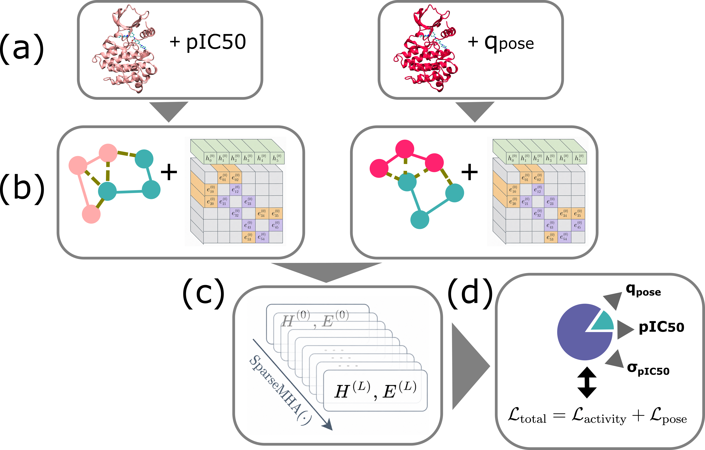

# Multi-objective Kinodata3D

Code and data-processing utilities for **No Pose Left Behind: Integrating Activity and Structural Data with Uncertainty-Aware Multiobjective Learning for Kinase Inhibitor Prediction**.

This repository contains the implementation of `mOKDDD`, a multi-objective E(3)-invariant graph neural network for kinase–ligand binding affinity prediction. The model is designed to learn from experimentally measured activity data paired with *in silico*-generated kinase–ligand complex structures of varying pose quality.

Unlike structure-based models that rely only on poses below a fixed RMSD cutoff, `mOKDDD` explicitly models structural reliability. For each kinase–ligand complex, the model jointly predicts:

- binding affinity, expressed as pIC50;
- activity uncertainty;
- pose quality, expressed as a structural reliability score.

The predicted pose quality is used to modulate the contribution of each structure to the activity loss, allowing the model to learn from heterogeneous structural data while giving greater importance to reliable complexes.

## Overview


## Overview

Structure-based machine learning for kinase inhibitor prediction is limited by the scarcity of experimentally resolved protein–ligand complexes. Computationally generated structures, such as docked poses, can reduce this limitation, but their usefulness depends strongly on pose quality.

`mOKDDD` addresses this by combining activity prediction with pose-quality estimation in a shared E(3)-invariant graph neural network.


The workflow consists of four main steps:

**(a) Dataset construction.**  
Two complementary datasets are used during training: an activity dataset containing kinase–ligand complexes with experimental pIC50 labels, and a pose-quality dataset containing generated cross-docked kinase–ligand poses with RMSD-derived pose-quality labels.

**(b) Graph construction and featurization.**  
Each kinase–ligand complex is converted into a molecular graph. Atoms are represented as nodes, while covalent bonds and spatial contacts are represented as edges. The graph is featurized using atom-level descriptors, bond-order information, and interatomic distances.

**(c) E(3)-invariant message passing.**  
Both activity and pose-quality mini-batches are processed by the same shared E(3)-invariant message-passing GNN. This produces learned node and edge embeddings while preserving invariance to rotations and translations of the input structure.

**(d) Multi-output readout and joint training.**  
A multi-output readout predicts binding affinity, activity uncertainty, and pose quality. These outputs are optimized jointly using a multi-objective loss that combines the activity and pose-quality objectives.

The activity objective learns binding affinity and uncertainty from kinase–ligand complexes with experimental activity labels, while the pose-quality objective learns to estimate the structural reliability of generated ligand poses. The predicted pose quality is then used to modulate the activity loss, allowing the model to learn from heterogeneous structural data while giving greater importance to reliable complexes.

## Model outputs

For each kinase–ligand complex `x`, the model predicts:

```text
mu(x)         predicted activity
sigma^2(x)   predicted activity variance
q_pose(x)    predicted pose quality

## Installation

We currently support installation from source.

### 1. Clone this repository

```
git clone https://github.com/raquellrios/multi-objective-kinodata-3D.git
cd multi-objective-kinodata-3D
git checkout paper_release
```

### 2. Set up Python environment
You can use mamba or conda to set up the environment
```
mamba env create -f kinodata_env.yml
mamba activate kinodata_env
```

Then, install the package with

```
pip install -e .
```